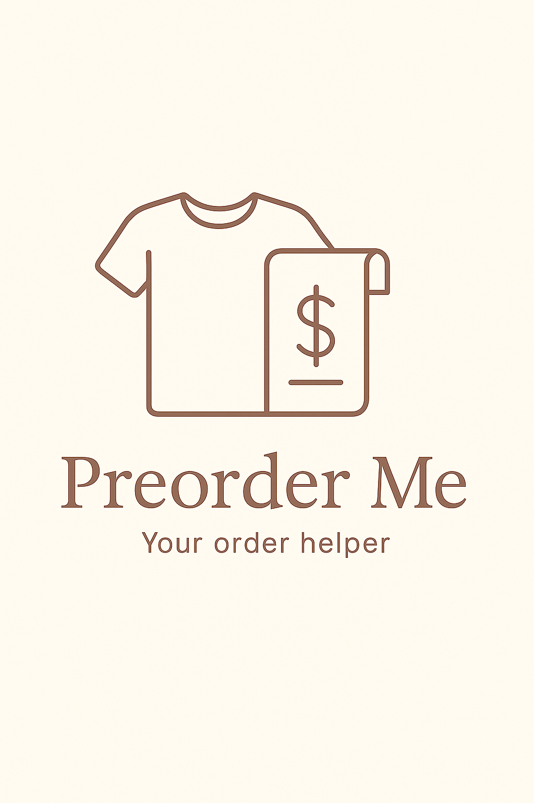

# 🛍️ Preorder Me

An intelligent assistant for generating optimized preorder lists based on manufacturer catalogs and past sales reports. Powered by machine learning and computer vision, the app helps determine what products and how many products while staying within a given budget.

---

## 📷 Logo

  

#### You can explore the project template here: [project_template.ipynb](project_template.ipynb)
---

## 💡 Purpose of this project

The “Preorder Me” project was created to simplify the work of purchasing teams in companies that need to regularly plan and place orders based on extensive product catalogs and historical sales data. By automating catalog analysis and demand forecasting, the app helps to:

- optimize preorder lists according to actual needs and available budget,
- reduce the risk of overstocking or stockouts,
- speed up the ordering process by eliminating manual and time-consuming tasks,
- make data-driven purchasing decisions instead of relying on intuition.

As a result, “Preorder Me” supports purchasing teams in managing inventory and budgets more efficiently, leading to cost savings and better alignment of product assortments with real demand.

---

## 📊 About the Data

The dataset contains sales-related information for a range of **football socks** (from the adidas brand), differentiated by **product color and size**, covering multiple years.

Each row represents a unique combination of product **color** (identified by index), **size**, and **year**, along with a set of sales and inventory metrics. The dataset is synthetic but structured to resemble realistic retail data. It was generated for the purpose of **exploratory data analysis (EDA)** and building **predictive machine learning models** (e.g., forecasting future sales or demand).

The dataset spans **12 product colors** and **8 sizes** (from KXXL to XS) for the years **2022 to 2027**, enabling time-based trend analysis and modeling.

> ⚠️ The high-quality public data in this domain is limited due to sensitivity of business-related sales records. Although dataset is synthetic, it is modeled after real-world Power BI retail reporting schemas and business logic used by distributors. It reflects common column structures such as margins, returns, stock coverage, and sales volumes.  — the dataset was generated to reflect realistic patterns without exposing actual company data.

### Columns:
* **`INDEX`** – Unique identifier of the product (varies by color)  
* **`BRAND`** – Product brand (fixed: adidas)  
* **`CATEGORY LVL1`** – Product category (fixed: TEKSTYLIA)  
* **`SIZE`** – Sock size (e.g., KXXL, XS, M, etc.)  
* **`Sales Net PLN`** – Net revenue from sales (in PLN)  
* **`Sales in COGS PLN`** – Cost of goods sold (in PLN)  
* **`Sales Margin PLN`** – Gross profit: Sales Net minus COGS  
* **`Sales Margin %`** – Gross margin expressed as a percentage  
* **`WOH 4W`** – Weeks of stock on hand (last 4 weeks)  
* **`WOH 13W`** – Weeks of stock on hand (last 13 weeks)  
* **`Stock Value PLN`** – Value of inventory (in PLN)  
* **`Stock Quantity`** – Number of items currently in stock  
* **`Units Sold`** – Number of units sold in the given year  
* **`Return Ratio`** – Ratio of returned products to units sold (percentage)  
* **`Year of Sales`** – Year the sale occurred

Additionally, this project includes:
- 🧾 A **manufacturer catalog** (initially limited to football socks) to simulate the available product assortment.
- 💰 An **API-based user input** of quarterly **budget** constraints, used to optimize which products and how many units should be pre-ordered.
  
---

## 🛠 Technologies and tools

- Python 🐍  
- Streamlit
- Scikit-learn
- OpenAI API   
- Pulp  
- Pandas  
- pdf2image  
- Seaborn  

---

## 🚀 Skills demonstrated in this project

- extracting product data from PDF catalogs using OCR and image classification  
- building regression models to forecast product quantities  
- performing exploratory data analysis (EDA) and preprocessing  
- optimizing shopping lists under budget constraints  
- building an interactive Streamlit app  
- integrating external APIs (OpenAI)  
- basic ETL pipeline planning and automation  

---

## 📋 Features and Flow

- Upload a PDF product catalog — the app detects product types, codes, and colors using Clarifai API.  
- Upload a historical `.xls` order report — data is analyzed to uncover demand patterns.  
- A regression model predicts the quantity of each item to order.  
- You can define a budget, and the app uses linear optimization to fit the list accordingly.  
- The app returns a final list of recommended products, sizes, and quantities.

