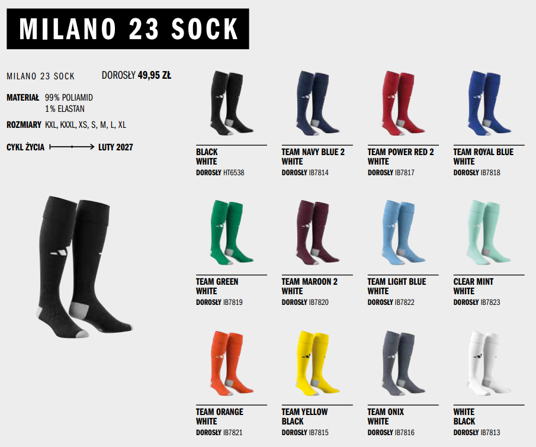

# 🛍️ Preorder Me

An intelligent assistant for generating optimized preorder lists based on manufacturer catalogs and past sales reports. Powered by machine learning and computer vision, the app helps determine what products and how many products while staying within a given budget.

---

## 📷 Logo

  

#### You can explore the project template here: [project_template.ipynb](project_template.ipynb)
---

## 💡 Purpose of this project

The “Preorder Me” project was created to simplify the work of purchasing teams in companies that need to regularly plan and place orders based on extensive product catalogs and historical sales data. By automating catalog analysis and demand forecasting, the app helps to:

- optimize preorder lists according to actual needs and available budget,
- reduce the risk of overstocking or stockouts,
- speed up the ordering process by eliminating manual and time-consuming tasks,
- make data-driven purchasing decisions instead of relying on intuition.

As a result, “Preorder Me” supports purchasing teams in managing inventory and budgets more efficiently, leading to cost savings and better alignment of product assortments with real demand.

---

## 🛠 Technologies and tools

- Python 🐍  
- Streamlit  
- OpenAI API  
- PyCaret  
- Pulp  
- Pandas  
- pdf2image  
- Seaborn  

---

## 🚀 Skills demonstrated in this project

- extracting product data from PDF catalogs using OCR and image classification  
- building regression models to forecast product quantities  
- performing exploratory data analysis (EDA) and preprocessing  
- optimizing shopping lists under budget constraints  
- building an interactive Streamlit app  
- integrating external APIs (OpenAI)  
- basic ETL pipeline planning and automation  

---

## 📋 Features and Flow

- Upload a PDF product catalog — the app detects product types, codes, and colors using Clarifai API.  
- Upload a historical `.xls` order report — data is analyzed to uncover demand patterns.  
- A regression model predicts the quantity of each item to order.  
- You can define a budget, and the app uses linear optimization to fit the list accordingly.  
- The app returns a final list of recommended products, sizes, and quantities.

👉 Initial focus: forecasting preorders for adidas football socks.

  

