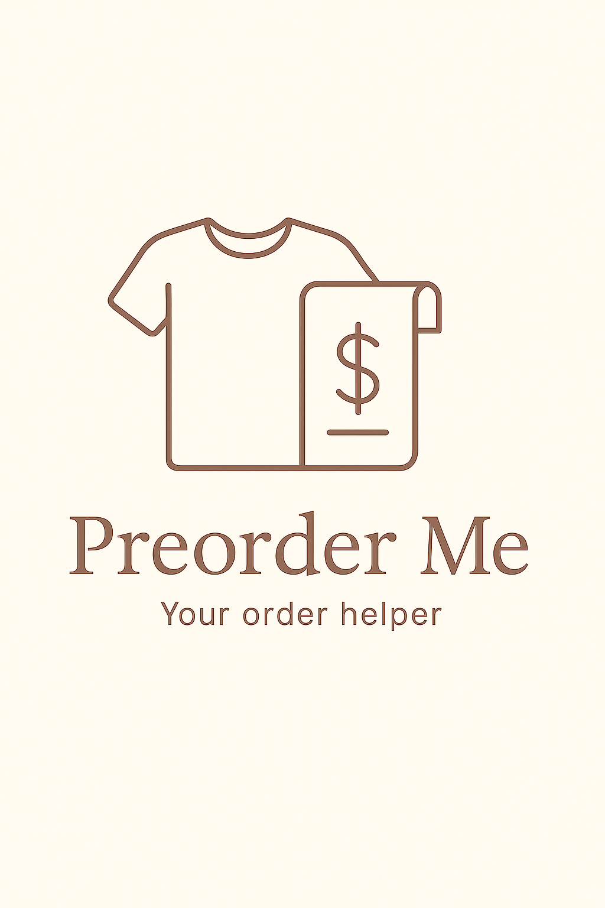

# 🛍️ Preorder Me

An intelligent assistant for generating optimized preorder lists based on manufacturer catalogs and past sales reports. Powered by machine learning and computer vision, the app helps determine what products to order — and how many — while staying within a given budget.

---

## 🔎 Preview

  

  

---

## 🛠 Technologies and tools

- Python 🐍  
- Streamlit  
- Clarifai API  
- PyCaret  
- Pulp  
- Pandas  
- pdf2image  
- Seaborn  

---

## 🚀 Skills demonstrated in this project

- extracting product data from PDF catalogs using OCR and image classification  
- building regression models to forecast product quantities  
- performing exploratory data analysis (EDA) and preprocessing  
- optimizing shopping lists under budget constraints  
- building an interactive Streamlit app  
- integrating external APIs (Clarifai)  
- basic ETL pipeline planning and automation  

---

## 📋 Features and Flow

- Upload a PDF product catalog — the app detects product types, codes, and colors using Clarifai API.  
- Upload a historical `.xls` order report — data is analyzed to uncover demand patterns.  
- A regression model predicts the quantity of each item to order.  
- You can define a budget, and the app uses linear optimization to fit the list accordingly.  
- The app returns a final list of recommended products, sizes, and quantities.

👉 Initial focus: forecasting preorders for Adidas football socks.

